# Dokumentasi Arsitektur Managed Agent Platform

Dokumen ini menjelaskan arsitektur project `managed-agents-project` berdasarkan struktur kode saat ini. Fokusnya adalah gambaran yang bisa dipakai untuk presentasi produk dan diskusi teknis: layer aplikasi, alur request, Arthur, tools, memory, RAG, MCP, token/quota, sandbox, sub-agent, WhatsApp, escalation, scheduler, dan deployment.

Tanggal snapshot: 2026-05-26.

## 1. Ringkasan Produk

Project ini adalah platform SaaS untuk membuat, menjalankan, dan mengelola agent AI multi-tenant. Tujuan utamanya bukan sekadar chatbot, tetapi agent yang bisa bekerja seperti staf digital: memahami SOP, mengingat konteks user/customer, memakai tool, mengambil dokumen knowledge base, menjalankan tugas di sandbox, membuat website/prototype, mengirim WhatsApp, menjadwalkan follow-up, melakukan escalation ke manusia, dan memakai integrasi eksternal seperti MCP.

Arthur adalah agent builder internal. Arthur bertugas membantu user non-teknis membuat agent baru lewat percakapan natural, memilih preset/capability, menyusun blueprint, membuat instruksi agent, mengaktifkan channel WhatsApp trial, dan menyimpan konfigurasi agent ke database.

Platform ini punya tiga konsep besar:

1. Control plane: API, dashboard/UI, Arthur, subscription, config agent, document upload, memory management.
2. Runtime plane: `run_agent`, LLM, Deep Agents graph, tool injection, sub-agent, sandbox, MCP, RAG, memory.
3. Channel plane: WhatsApp/web/API session, inbound message, media, operator escalation, scheduled/proactive outbound.

## 2. High-Level Architecture

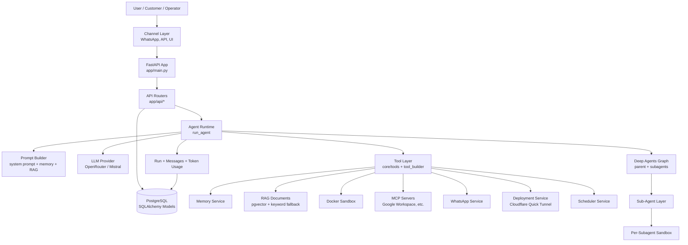

### Visualisasi ASCII

Bagian ini sengaja dibuat dalam bentuk text diagram agar tetap enak dibaca saat file Markdown dibuka di terminal, VS Code raw view, atau dipakai sebagai bahan slide tanpa Mermaid renderer.

#### ASCII 1: Arsitektur Utama

```text
Client / User
|-- WhatsApp customer
|-- WhatsApp operator/admin
|-- Web dashboard / UI
|-- External API client
|-- Webhook / scheduled event
|
v
FastAPI Backend (app/main.py)
|-- API Routers
|   |-- auth / users / subscriptions
|   |-- agents / sessions / messages / runs
|   |-- channels / WhatsApp incoming
|   |-- documents / memory / skills / custom_tools
|   |-- integrations / models / stream
|
|-- Agent Runtime Engine
|   |-- run_agent()
|   |-- session lock + cancellation
|   |-- prompt builder
|   |-- context/history loader
|   |-- RAG context injector
|   |-- MCP runtime preparer
|   |-- tool setup
|   |-- result parser + reply guard
|
|-- LLM Provider Layer
|   |-- OpenRouter -> GPT / Claude / Gemini / Llama / DeepSeek / Mistral / etc
|   |-- Mistral direct for mistral/* models and OCR-related usage
|   |-- per-agent model, temperature, max_tokens
|
|-- Deep Agents Executor
|   |-- parent agent graph
|   |-- task() delegation
|   |-- built-in subagents
|   |-- checkpointer fallback
|   |-- tool calling
|
|-- Tool Layer
|   |-- Memory tools
|   |-- RAG / document tools
|   |-- Arthur builder tools
|   |-- WhatsApp media tools
|   |-- Escalation + operator tools
|   |-- Scheduler + heartbeat tools
|   |-- HTTP + Tavily tools
|   |-- MCP tools
|   |-- Deployment tools
|
|-- Docker Sandbox
|   |-- workspace persists per session
|   |-- ephemeral container per execute/bash call
|   |-- sub-sandbox per subagent
|   |-- shared workspace for parent/subagent artifacts
|
|-- Persistence
|   |-- PostgreSQL
|   |-- pgvector for document embeddings
|   |-- Agent / Session / Message / Run
|   |-- Memory / Document / Skill / CustomTool
|   |-- User / Subscription / ScheduledJob
|
|-- External Services
    |-- wa-service     (port 8080) production WhatsApp devices
    |-- wa-dev-service (port 8081) shared trial WhatsApp number
    |-- Redis optional for event bus / rate limit
    |-- Cloudflare Quick Tunnel for deployed prototypes
    |-- MCP servers, e.g. Google Workspace runtime
```

#### ASCII 2: Layer Control Plane vs Runtime Plane vs Channel Plane

```text
Managed Agent SaaS
|
|-- Control Plane
|   |-- Arthur creates agents
|   |-- Dashboard manages agents, documents, memory, runs
|   |-- Subscription checks plan, quota, slot
|   |-- Config validates tools_config and entitlements
|   |-- Owner/operator mapping
|
|-- Runtime Plane
|   |-- run_agent()
|   |-- LLM call
|   |-- Deep Agents graph
|   |-- tool injection per run
|   |-- short-term history
|   |-- long-term memory
|   |-- RAG retrieval
|   |-- MCP connection
|   |-- sandbox and subagents
|   |-- token accounting
|
|-- Channel Plane
    |-- WhatsApp incoming/outgoing
    |-- API chat
    |-- dashboard stream/SSE
    |-- media/document/audio processing
    |-- human escalation
    |-- operator reply routing
    |-- scheduler/heartbeat outbound
```

#### ASCII 3: Satu Pesan Masuk Sampai Agent Membalas

```text
Incoming message
|
|-- Resolve channel
|   |-- API message
|   |-- WhatsApp message
|   |-- scheduled reminder
|
|-- Resolve Agent + Session
|   |-- load Agent by id / device_id
|   |-- find or create Session
|   |-- attach external_user_id
|   |-- attach channel_config
|
|-- Pre-run Guards
|   |-- dedupe inbound message
|   |-- allowlist sender check
|   |-- operator/customer classification
|   |-- token quota check
|   |-- active_until check
|   |-- cancel previous active run if user interrupts
|
|-- Build Runtime Context
|   |-- load short-term history
|   |-- load global memory
|   |-- load scoped user/customer memory
|   |-- retrieve RAG snippets
|   |-- process media/document/audio context
|   |-- prepare MCP auth/runtime
|
|-- Build Agent Execution
|   |-- build system prompt
|   |-- build tool list
|   |-- attach sandbox backend
|   |-- attach subagents
|   |-- attach callback logger
|
|-- Execute
|   |-- LLM thinks
|   |-- calls tools if needed
|   |-- delegates to subagent if needed
|   |-- writes/reads files if sandbox needed
|   |-- executes MCP if external integration needed
|
|-- Post-run
|   |-- parse final reply
|   |-- apply reply guard
|   |-- persist Run + Message + tool traces
|   |-- record token usage
|   |-- extract long-term memory if due
|   |-- close sandbox/sub-sandbox
|
v
Send reply to user/channel
```

#### ASCII 4: Arthur sebagai Agent Builder

```text
User: "Bikinin agent untuk usaha saya"
|
v
Arthur (builder-capability agent)
|
|-- Discovery
|   |-- tanya jenis usaha/use case
|   |-- tanya target customer
|   |-- tanya SOP dan gaya bahasa
|   |-- tanya data wajib
|   |-- tanya operator/admin
|   |-- tanya payment/approval/deliverable rules
|
|-- Planning
|   |-- get_presets()
|   |-- plan_agent()
|   |-- compose_agent_blueprint()
|   |-- compose_agent_instructions()
|   |-- compose_agent_soul()
|
|-- Validation
|   |-- get_user_subscription()
|   |-- validate_agent_config()
|   |-- check model/tool entitlement
|   |-- check max agent slot
|
|-- Creation
|   |-- create_agent()
|   |-- set owner_external_id
|   |-- set operator_ids
|   |-- set tools_config
|   |-- seed memory: soul + blueprint
|
|-- Delivery
    |-- create_wa_dev_trial_link()
    |-- send vCard/contact shared trial number
    |-- explain how user tests the new agent
```

#### ASCII 5: Tool Injection per Run

```text
build_agent_tool_setup()
|
|-- Always evaluate runtime policy
|   |-- builder agent?
|   |-- operational agent?
|   |-- operator turn?
|   |-- Google MCP parent-only?
|
|-- tools_config.memory=true
|   |-- remember
|   |-- recall
|   |-- forget
|   |-- update_daily
|   |-- update_longterm
|
|-- tools_config.skills=true
|   |-- create_skill
|   |-- list_skills
|   |-- use_skill
|
|-- tools_config.sandbox=true
|   |-- DockerBackend file tools
|   |-- sandbox_write_binary_file
|
|-- tools_config.deploy=true
|   |-- deploy_app
|   |-- stop_deployment
|   |-- get_deployment_status
|   |-- get_deployment_logs
|
|-- tools_config.escalation=true
|   |-- escalate_to_human
|   |-- reply_to_user
|   |-- send_to_number
|
|-- WhatsApp session
|   |-- notify_user
|   |-- send_whatsapp_image
|   |-- send_whatsapp_document
|   |-- send_agent_wa_qr
|
|-- capabilities contains "builder"
|   |-- Arthur builder tools
|
|-- tools_config.mcp enabled
|   |-- MCP server tools
|
|-- tools_config.subagents enabled
    |-- sys_coder
    |-- sys_researcher
    |-- sys_critic
    |-- sys_writer
    |-- sys_analyst
```

#### ASCII 6: Memory + RAG + Prompt Composition

```text
Prompt Builder
|
|-- Static Agent Config
|   |-- name
|   |-- description
|   |-- instructions
|   |-- safety_policy
|
|-- Short-Term Memory
|   |-- recent Message rows
|   |-- max turns from settings.short_term_memory_turns
|   |-- excludes abandoned/cancelled/failed run history
|
|-- Layered Long-Term Memory
|   |-- global scope
|   |   |-- soul
|   |   |-- blueprint
|   |   |-- global SOP
|   |
|   |-- scoped to external_user_id
|       |-- user_profile
|       |-- longterm
|       |-- daily:today
|       |-- daily:yesterday
|       |-- business/order state
|
|-- RAG Context
|   |-- embed user query
|   |-- vector search pgvector
|   |-- keyword fallback
|   |-- inject relevant snippets
|
|-- Runtime Notices
|   |-- active tool groups
|   |-- channel context
|   |-- operator/escalation context
|   |-- MCP priority notice
|
v
Final system prompt sent to LLM
```

#### ASCII 7: WhatsApp Escalation Flow

```text
Customer
|
|-- sends message / screenshot / document
v
Customer Session
|
|-- agent detects human approval needed
|-- stores last_incoming_media in session.metadata
|-- calls escalate_to_human(reason, summary)
v
Operator WhatsApp
|
|-- receives:
|   |-- ESKALASI PESAN DARI CUSTOMER
|   |-- ID Kasus
|   |-- Nomor customer/user
|   |-- Nama customer
|   |-- Alasan eskalasi
|   |-- Pesan
|   |-- Cara balas customer
|   |-- forwarded attachment if any
|
|-- operator replies by quoting escalation
v
WhatsApp Incoming Router
|
|-- resolve quoted WhatsApp message
|-- resolve escalation_case_id
|-- resolve original customer session
|-- detect payment/admin approval if relevant
|
|-- if approval:
|   |-- inject [SYSTEM_OPERATOR_APPROVAL] to customer session
|   |-- resume customer workflow
|
|-- if normal operator answer:
    |-- send reply_to_user(message)
```

#### ASCII 8: Generic Approval + Deliverable State Machine

```text
Business / Personal Assistant Agent
|
|-- intake
|   |-- collect required data
|   |-- ask missing required data
|
|-- work_in_progress
|   |-- execute task
|   |-- create draft/file/result if needed
|   |-- store progress/state in scoped memory
|
|-- waiting_external_input
|   |-- wait for payment, document, confirmation, or missing data
|   |-- do not deliver restricted result yet
|
|-- human_review
|   |-- escalate to operator/admin if approval is required
|   |-- forward relevant text/media/document
|
|-- approved
|   |-- system routes operator approval to original customer session
|   |-- continue from stored state
|
|-- rejected_or_needs_revision
|   |-- ask customer/admin for correction
|   |-- keep current task state
|
|-- delivery
|   |-- send final answer/file/link/result
|   |-- avoid rebuilding work in operator session
|
|-- aftercare
    |-- follow up
    |-- keep useful state in memory
```

#### ASCII 9: Sandbox, Subagent, dan Deployment

```text
Parent Agent Session
|
|-- workspace: /tmp/agent-sandboxes/{session_id}
|-- DockerBackend
|   |-- read/write/edit/ls/glob/grep on host workspace
|   |-- execute() via ephemeral Docker container
|
|-- task() to sys_coder
|   |-- sub-workspace: /tmp/agent-sandboxes/{subagent_session_id}
|   |-- shared/ symlink or shared dir with parent
|   |-- writes HTML/CSS/JS/files
|   |-- runs local server command
|   |-- deploy_app(command, port)
|       |-- app container: madeploy-app-{session}
|       |-- cloudflared container: madeploy-cf-{session}
|       |-- public URL: https://*.trycloudflare.com
|       |-- TTL default: 1 hour
|
|-- task() to sys_analyst
|   |-- own sub-sandbox
|   |-- reads data
|   |-- writes analysis output
|
|-- task() to sys_researcher
|   |-- HTTP / Tavily
|   |-- returns research summary
|
|-- task() to sys_critic
    |-- reviews output
    |-- flags quality issues
```

#### ASCII 10: Token Quota Gate

```text
Before run_agent()
|
|-- check active_until
|   |-- expired -> block: renew/upgrade
|
|-- check agent token quota
|   |-- token_quota <= 0 -> unlimited
|   |-- tokens_used >= token_quota -> block
|
|-- check owner subscription
|   |-- missing owner -> allow legacy path
|   |-- subscription not usable -> block
|   |-- subscription token_quota <= 0 -> custom/unlimited legacy
|   |-- subscription.tokens_used >= subscription.token_quota -> block
|
|-- allowed
|   |-- run LLM/tool graph
|   |-- collect callback token usage
|   |-- persist Run usage
|   |-- increment agent.tokens_used
|   |-- increment owner subscription.tokens_used
|
v
Next run sees latest quota usage
```

#### ASCII 11: Data Model Ringkas

```text
User
|-- UserSubscription
|   |-- SubscriptionPlan
|
|-- UserApiKey
|
|-- Agent (owner_external_id)
    |-- Session
    |   |-- Message
    |   |-- Run
    |   |-- ScheduledJob
    |
    |-- Memory
    |   |-- scope NULL: global agent memory
    |   |-- scope external_user_id: customer/user memory
    |
    |-- Document
    |   |-- content
    |   |-- embedding pgvector
    |
    |-- Skill
    |
    |-- CustomTool
    |
    |-- ScheduledJob
```

#### ASCII 12: Infrastruktur WhatsApp

```text
WhatsApp Infra
|
|-- wa-service (port 8080)
|   |-- production WhatsApp microservice
|   |-- one connected device can map to one agent
|   |-- used for real owner/operator/customer flows
|
|-- wa-dev-service (port 8081)
|   |-- shared trial number
|   |-- multi-agent trial routing
|   |-- routes by wadev_{agent_id} / trial code
|   |-- not Arthur's own identity
|
|-- Arthur WhatsApp device
    |-- dedicated device/session for Arthur
    |-- can send shared trial vCard/contact
    |-- should not fall back to wadev_ identity
```

### Visualisasi Mermaid Tambahan

Diagram di bawah bisa dirender langsung oleh Markdown viewer yang mendukung Mermaid, misalnya GitHub, GitLab, Obsidian, atau Mermaid Live Editor.

#### Visual 1: Peta Layer Platform

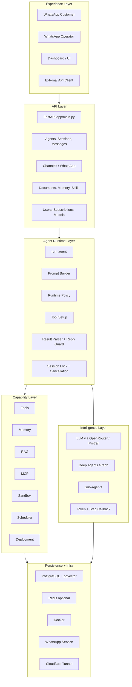

#### Visual 2: Runtime Pipeline Satu Pesan

```mermaid
flowchart LR
    A["Inbound message"] --> B["Resolve Agent + Session"]
    B --> C["Quota Gate"]
    C -->|blocked| C1["Return quota/expired message"]
    C -->|allowed| D["Cancel old active run if needed"]
    D --> E["Acquire session lock"]
    E --> F["Load short-term history"]
    F --> G["Load layered memory"]
    G --> H["Retrieve RAG context"]
    H --> I["Prepare MCP runtime"]
    I --> J["Build tools + subagents"]
    J --> K["Build system prompt"]
    K --> L["Run Deep Agents graph"]
    L --> M["Parse tool calls + final reply"]
    M --> N["Apply reply guards"]
    N --> O["Persist Run + Messages + Usage"]
    O --> P["Record token usage"]
    P --> Q["Send channel reply"]
```

#### Visual 3: Arthur Membuat Agent Baru

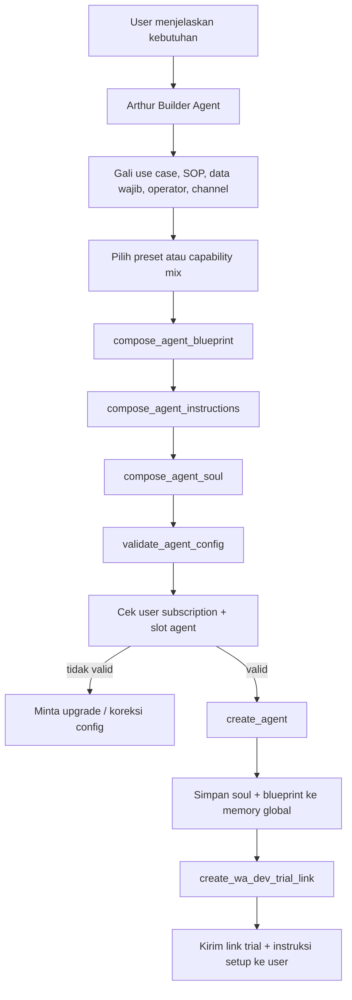

#### Visual 4: Komposisi Context Agent

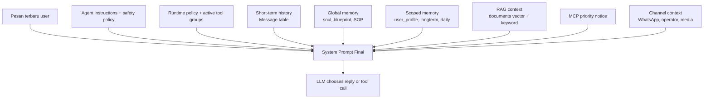

#### Visual 5: Memory Layer

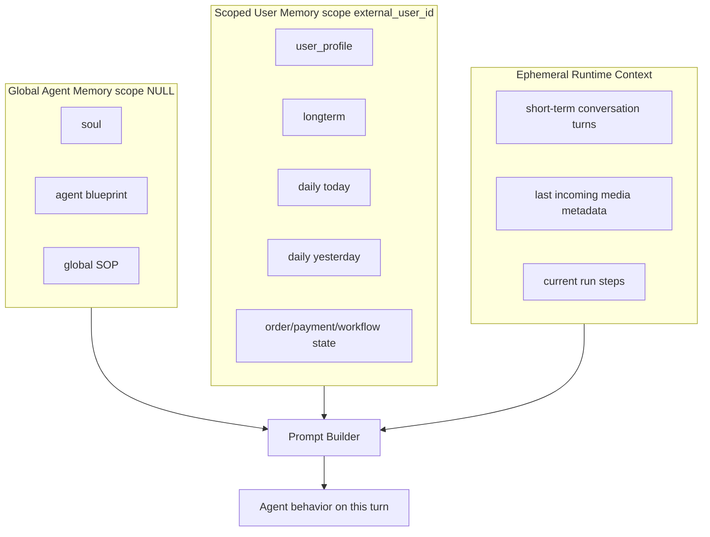

#### Visual 6: RAG Retrieval

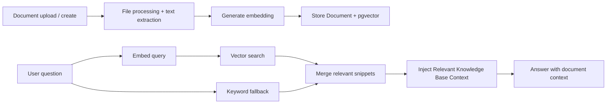

#### Visual 7: MCP Routing

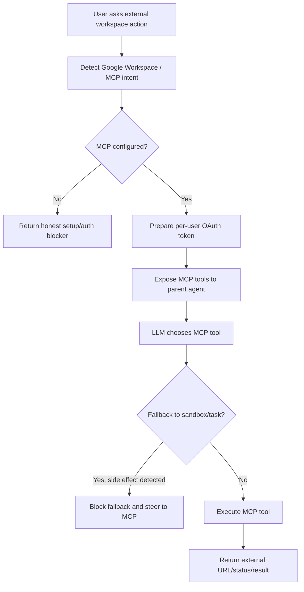

#### Visual 8: Token dan Quota Gate

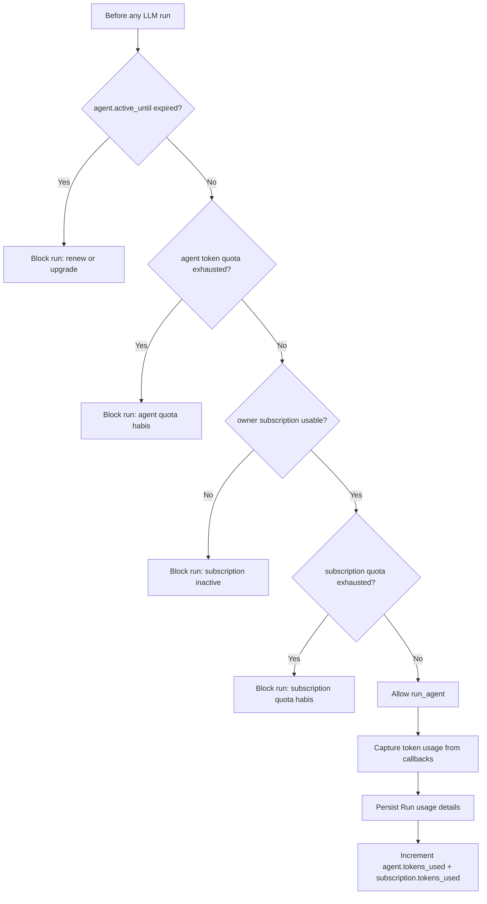

#### Visual 9: Sandbox dan Sub-Agent Topology

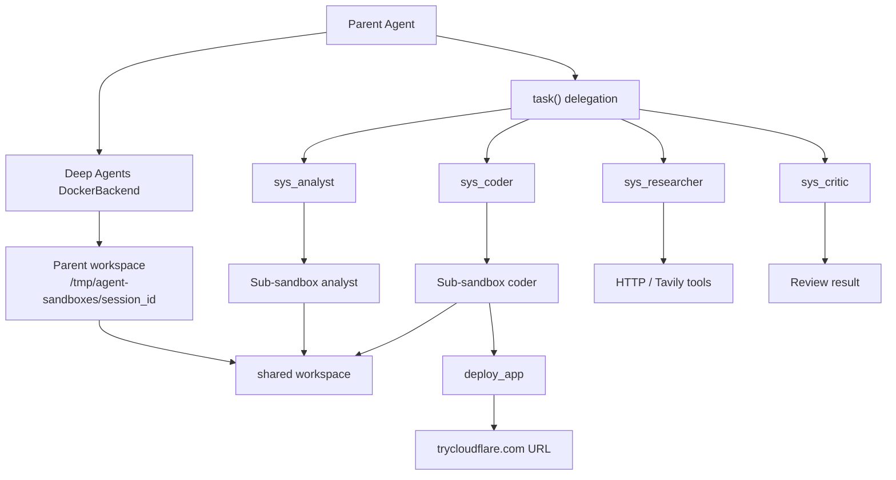

#### Visual 10: WhatsApp Escalation State Machine

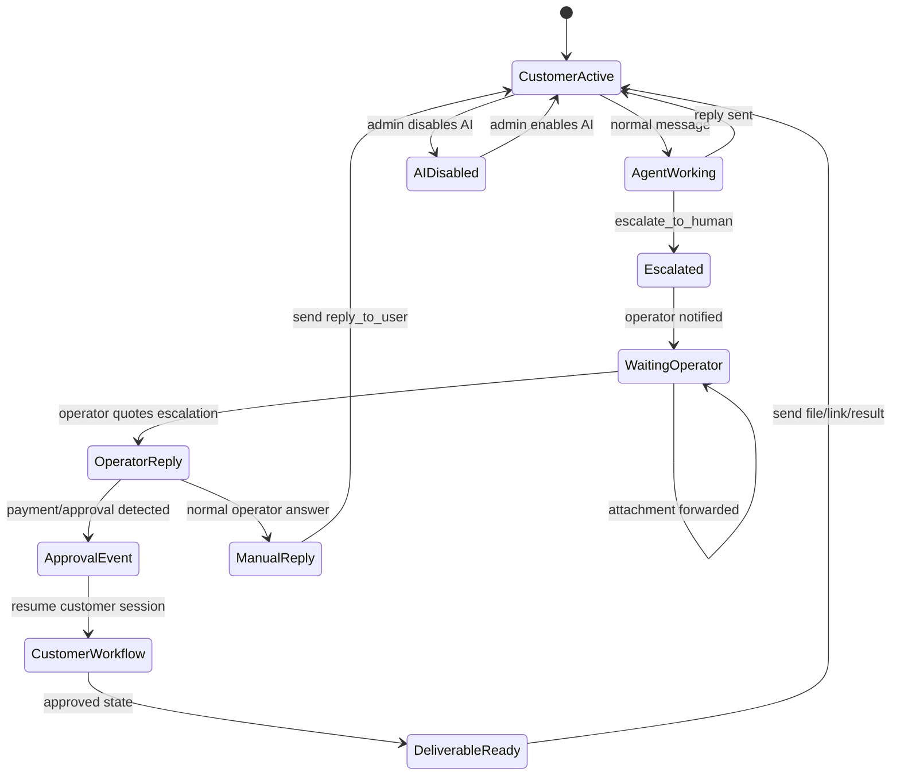

#### Visual 11: Data Relationship Map

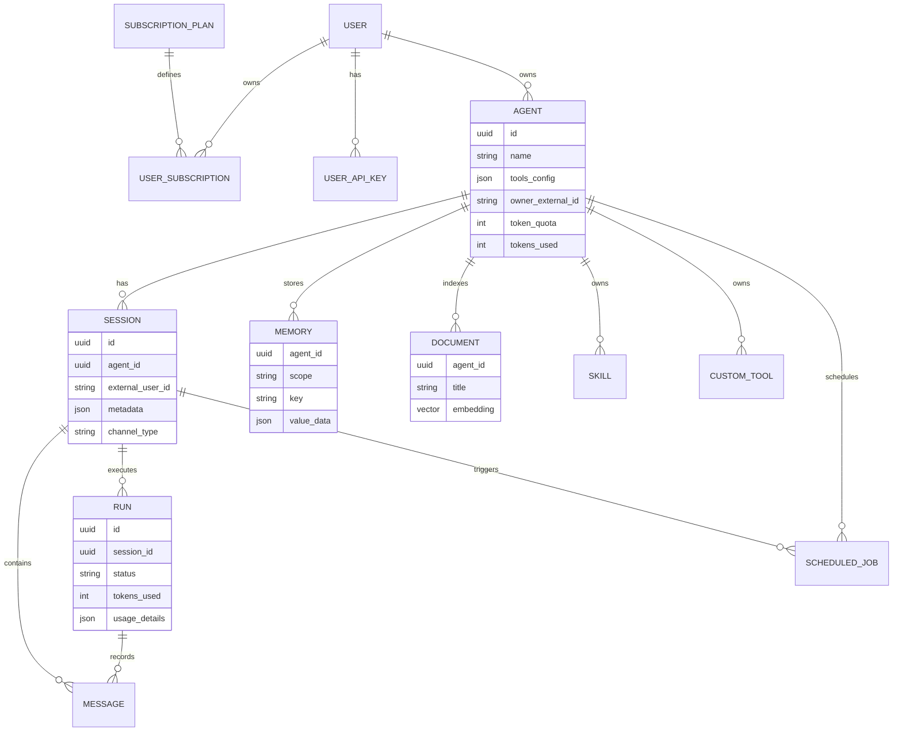

#### Visual 12: Capability Routing Matrix

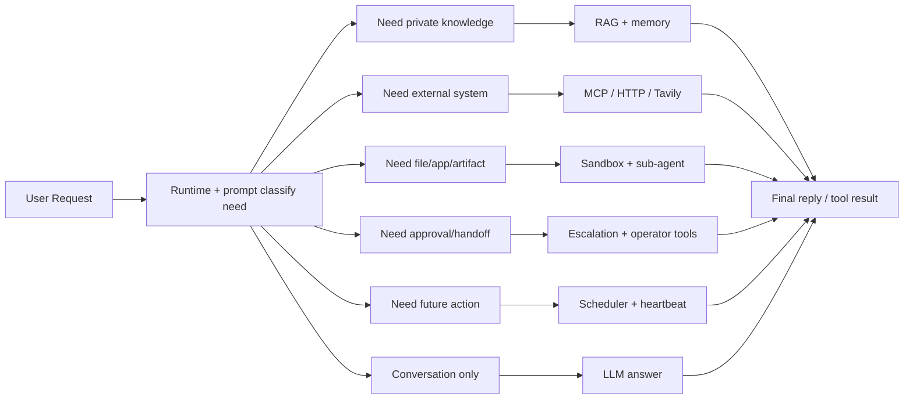

## 3. Layer Project

| Layer | Path | Fungsi utama |
| --- | --- | --- |
| App entrypoint | `app/main.py` | Membuat FastAPI app, register router, CORS, metrics, lifespan startup/shutdown, scheduler, health check. |
| API layer | `app/api/*` | Endpoint HTTP untuk auth, users, agents, sessions, messages, WhatsApp channel, documents, memory, skills, runs, stream, integrations, subscriptions. |
| Runtime engine | `app/core/engine/*` | Orkestrasi agent: LLM setup, prompt, context history, Deep Agents graph, tool setup, sub-agent, callbacks, result parser, reply guard, session lock. |
| Tool layer | `app/core/tools/*` | Implementasi tool yang bisa dipakai agent: Arthur builder, RAG, MCP, HTTP, Tavily, scheduler, deployment, escalation, operator tools. |
| Domain service | `app/core/domain/*` | Business logic per domain: memory, document/RAG, embedding, skill, custom tool, subscription, quota, file processing, WA dev trial. |
| Infra layer | `app/core/infra/*` | Integrasi eksternal dan resource: Docker sandbox, WhatsApp client, channel service, deployment service, Redis client, transcription. |
| Worker layer | `app/core/workers/*` | Scheduler/proactive agent loop dan event bus untuk realtime update. |
| Model layer | `app/models/*` | SQLAlchemy ORM: Agent, Session, Message, Run, Memory, Document, Skill, CustomTool, Subscription, ScheduledJob, API key, integration token. |
| Schema layer | `app/schemas/*` | Pydantic request/response schemas. |
| Frontend/UI | `UI-DEV` mounted at `/ui` | Dashboard/dev UI untuk mengelola agent dan interaksi. |

## 4. Entrypoint dan Startup

`app/main.py` membuat FastAPI app dengan router utama:

- `auth`
- `users`
- `subscriptions`
- `agents`
- `channels`
- `sessions`
- `messages`
- `history`
- `memory`
- `skills`
- `custom_tools`
- `documents`
- `models`
- `runs`
- `stream`
- `integrations`

Saat startup, app melakukan beberapa pekerjaan penting:

- Warmup embedding model agar RAG tidak lambat di request pertama.
- Menandai `Run.status='running'` lama sebagai `abandoned` agar service restart tidak otomatis mengulang tugas lama.
- Start scheduler service.
- Register Prometheus `/metrics`.
- Mount dashboard UI ke `/ui`.

Health check:

- `/health`: basic status.
- `/health/detailed`: cek database, scheduler, dan WhatsApp service.

## 5. Data Model Utama

### Agent

`Agent` adalah konfigurasi pekerja AI. Field penting:

- `name`, `description`, `instructions`: identitas dan instruksi kerja.
- `model`, `temperature`, `max_tokens`: konfigurasi LLM.
- `tools_config`: capability runtime dalam bentuk JSON.
- `sandbox_config`, `safety_policy`, `escalation_config`: guard dan policy.
- `capabilities`: contoh `["builder"]` untuk Arthur.
- `wa_device_id`, `channel_type`, `allowed_senders`: channel dan akses WhatsApp.
- `operator_ids`, `owner_external_id`: operator/admin dan owner agent.
- `token_quota`, `tokens_used`, `active_until`, `quota_period_days`: quota per agent.
- `api_key`: key akses API agent.
- `is_deleted`, timestamps, versioning.

### Session

`Session` menyimpan percakapan user dengan agent:

- `agent_id`
- `external_user_id`: nomor WA/user ID/customer ID.
- `metadata_`: metadata runtime, escalation, media terakhir, route operator.
- `workspace_dir`: direktori sandbox per session.
- `channel_type`, `channel_config`: routing outbound.
- `escalation_active`, `ai_disabled`: state handoff manusia.

### Message

`Message` menyimpan history percakapan dan jejak tool:

- `role`: `user`, `agent`, atau tool-related role.
- `content`
- `tool_name`, `tool_args`, `tool_result`
- `step_index`
- `run_id`

### Run

`Run` adalah satu eksekusi agent:

- `status`: running, completed, failed, cancelled, timed_out, abandoned.
- `started_at`, `completed_at`, `error_message`.
- Token detail: `tokens_used`, `prompt_tokens`, `completion_tokens`, `reasoning_tokens`, `cached_tokens`, `openrouter_cost_usd`, `usage_details`.

### Memory

`Memory` adalah long-term/per-user memory agent:

- `agent_id`
- `scope`: `NULL` untuk global agent, atau `external_user_id` untuk user/customer tertentu.
- `key`
- `value_data`

### Document

`Document` adalah knowledge base untuk RAG:

- `agent_id`
- `title`
- `content`
- `source`
- `doc_metadata`
- `embedding` pgvector

### Subscription

Subscription mengatur entitlement user:

- `SubscriptionPlan`
- `User`
- `UserSubscription`
- `UserApiKey`

Plan default:

| Plan | Token quota | Max agent | Model | Sub-agent | WA |
| --- | ---: | ---: | --- | --- | --- |
| Trial | 2,000,000 | 1 | `openai/gpt-4.1-mini` | Tidak | Ya |
| Starter / Tier 1 | 10,000,000 | 1 | `openai/gpt-4.1-mini` | Ya | Ya |
| Pro / Tier 2 | 20,000,000 | 2 | `openai/gpt-4.1-mini`, `deepseek/deepseek-v4-flash` | Ya | Ya |
| Enterprise / Tier 3 | 100,000,000 | Unlimited | Tidak dibatasi | Ya | Ya |

## 6. Request Flow Umum

### API Chat Flow

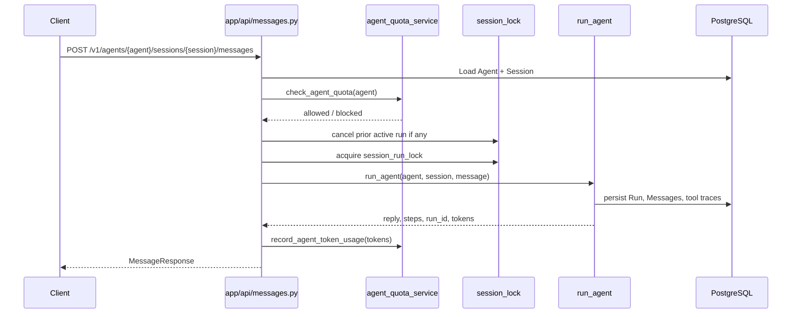

### WhatsApp Incoming Flow

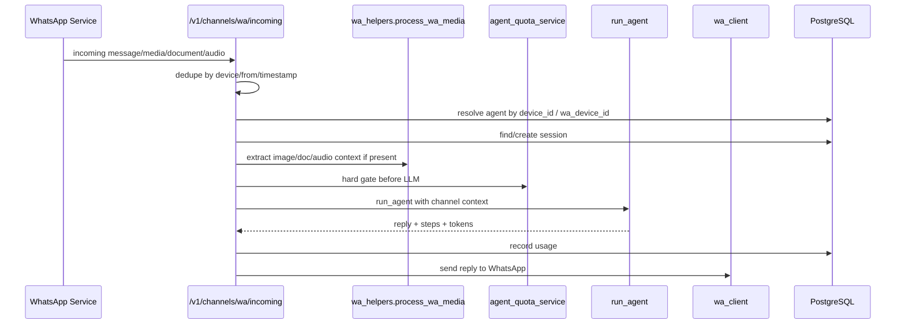

### Arthur Agent Creation Flow

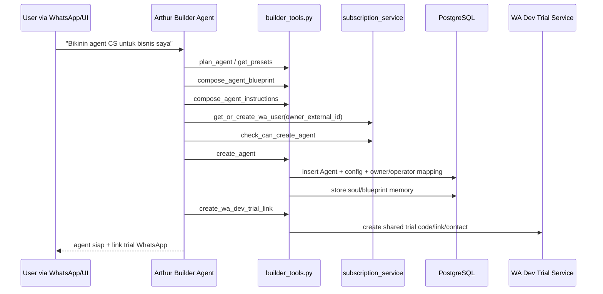

## 7. Runtime Agent: `run_agent`

`app/core/engine/agent_runner.py` adalah entrypoint eksekusi agent. Secara konsep, setiap run melakukan:

1. Load settings, agent config, session, dan runtime policy.
2. Setup LLM lewat `build_agent_llms`.
3. Setup sandbox jika tool membutuhkan sandbox/deployment.
4. Build tool list lewat `build_agent_tool_setup`.
5. Prepare MCP runtime jika agent punya MCP config.
6. Build memory context:
   - short-term history dari `Message`.
   - long-term memory dari `Memory`.
   - layered memory seperti `soul`, `user_profile`, `daily`.
7. Build RAG context jika `tools_config.rag` aktif.
8. Build system prompt lewat `prompt_builder`.
9. Buat Deep Agents graph:
   - parent agent.
   - optional built-in/user subagents.
   - optional Docker backend.
   - optional checkpointer.
10. Jalankan graph dengan callback logger.
11. Parse result, tool calls, steps, dan final reply.
12. Terapkan guard:
   - MCP auth/error recovery.
   - anti-fake-success dari subagent blocker.
   - duplicate final suppression untuk WhatsApp.
   - operator/escalation routing.
   - deploy/link/media follow-up rules.
13. Simpan `Run`, `Message`, tool trace, dan token usage.
14. Jalankan long-term memory extraction periodik.
15. Close sandbox dan sub-sandbox.

## 8. LLM Layer

LLM dibuat oleh `app/core/engine/agent_llm.py`.

Provider:

- Model prefix `mistral/` atau `mistral-`: memakai Mistral API.
- Selain itu: memakai OpenRouter API.

Konfigurasi:

- `agent.model`
- `agent.temperature`
- `agent.max_tokens` atau fallback `settings.llm_max_tokens`
- `parallel_tool_calls=False` untuk mengurangi tool-call paralel yang sulit dikendalikan.

Token usage ditangkap oleh callback `AgentStepLogger`:

- `prompt_tokens`
- `completion_tokens`
- `reasoning_tokens`
- `cached_tokens`
- `total_tokens`
- `cost_usd`
- `usage_details` per run/model/tool path

## 9. Runtime Policy

`app/core/engine/agent_policy.py` membedakan dua kelas agent:

| Policy | Kapan dipakai | Dampak |
| --- | --- | --- |
| `builder` | `capabilities` berisi `builder` atau `tools_config.builder=true` | Agent dianggap Arthur/builder, tool builder bisa dibuka. |
| `operational` | Agent normal user/customer | Tool dibuka sesuai `tools_config`, entitlement, channel, dan policy. |

Policy juga menjaga agar Google Workspace MCP tidak kalah oleh sandbox/subagent untuk tugas eksternal. Jika MCP tersedia dan user meminta side effect Google Workspace, fallback ke `task`, `execute`, `write_file`, `edit_file`, `read_file`, atau `sandbox_write_binary_file` bisa diblokir.

## 10. Tool Injection

Tool tidak dibuka semua secara global. Tool list dibangun per run oleh `build_agent_tool_setup(...)`.

Faktor yang mempengaruhi tool injection:

- `agent.tools_config`
- `agent.capabilities`
- `session.channel_type`
- `session.external_user_id`
- apakah turn ini operator turn
- apakah sandbox tersedia
- apakah MCP Google Workspace butuh parent-only path
- apakah subagent aktif
- apakah user meminta link saja atau butuh media/file

Operator turn sengaja dibatasi:

- Sandbox, skill, tool creator, subagent, dan beberapa tool berisiko tidak dibuka untuk operator turn.
- Operator mendapat `operator_tools` dan escalation reply path.

Jika subagent aktif:

- Deployment tool parent bisa di-strip.
- `sys_coder` atau subagent sandbox yang bertanggung jawab menulis/deploy artifact.

## 11. `tools_config` Capability Map

Schema validasi ada di `app/core/config_schema.py`.

| Key | Default | Fungsi |
| --- | --- | --- |
| `sandbox` | `false` | Membuka Docker sandbox/Deep Agents backend. |
| `deploy` | `false` | Membuka Cloudflare tunnel deployment tools. |
| `tool_creator` | `false` | Agent bisa membuat custom Python tools. Wajib `sandbox=true`. |
| `scheduler` | `false` | Agent bisa membuat reminder/proactive jobs. |
| `http` | `false` | Agent bisa melakukan HTTP request. |
| `tavily` | `true` | Agent bisa web search lewat Tavily jika API key tersedia. |
| `escalation` | `true` | Agent bisa eskalasi ke human/operator. |
| `rag` | `false` | Agent memakai knowledge base documents. |
| `memory` | `true` | Agent bisa remember/recall/update memory. |
| `skills` | `true` | Agent bisa membuat dan memakai skill reusable. |
| `whatsapp_media` | `true` | Agent bisa kirim gambar/dokumen via WhatsApp. |
| `wa_agent_manager` | `false` | Tool manajemen QR/link WhatsApp agent. |
| `subagents` | `{enabled:false}` | Membuka sub-agent built-in atau agent lain. |
| `mcp` | `{}` | Konfigurasi MCP server. |

## 12. Tool Catalog

### Memory Tools

Dibuat oleh `build_memory_tools(...)`.

| Tool | Fungsi |
| --- | --- |
| `remember(key, value)` | Simpan memory scoped untuk user/customer/session. |
| `recall(query)` | Ambil memory relevan. |
| `forget(key)` | Hapus memory. |
| `update_daily(content)` | Update catatan harian user/customer. |
| `update_longterm(content)` | Update long-term summary. |

### Heartbeat Tools

| Tool | Fungsi |
| --- | --- |
| `enable_heartbeat(...)` | Membuat proactive checklist berulang. |
| `disable_heartbeat(...)` | Mematikan heartbeat user/customer. |

Heartbeat disimpan sebagai `ScheduledJob` dengan label `heartbeat:<scope>` dan config di memory key `heartbeat:config`.

### Skill Tools

| Tool | Fungsi |
| --- | --- |
| `create_skill` | Membuat/update reusable instruction block. |
| `list_skills` | Melihat skill agent. |
| `use_skill` | Memakai skill sebagai konteks kerja. |

Skill cocok untuk SOP yang sering dipakai: cara closing, template follow-up, cara membuat CV, aturan brand voice, dan lain-lain.

### Custom Tool Creator

| Tool | Fungsi |
| --- | --- |
| `create_tool` | Menyimpan custom Python tool setelah validasi syntax AST. |
| `list_tools` | Melihat custom tools agent. |
| `run_custom_tool` | Menjalankan custom tool di sandbox. |

Keamanan: kode tidak dieksekusi di proses API, tetapi di Docker sandbox.

### Sandbox / Deep Agents File Tools

Deep Agents backend memakai `DockerBackend` di `app/core/engine/deep_agent_backend.py`.

Capability:

- `read`
- `write`
- `edit`
- `ls`
- `glob`
- `grep`
- `execute`
- async variants

File operation berjalan langsung di host workspace yang aman. `execute()` baru memakai Docker container.

Tool tambahan:

| Tool | Fungsi |
| --- | --- |
| `sandbox_write_binary_file` | Menulis file binary/base64 ke sandbox workspace. |

### Deployment Tools

Dibuat oleh `build_deployment_tools(...)`.

| Tool | Fungsi |
| --- | --- |
| `deploy_app(command, port=8080)` | Menjalankan app dari workspace dan membuka public URL via Cloudflare Quick Tunnel. |
| `stop_deployment()` | Menghentikan deployment session. |
| `get_deployment_status()` | Mengecek status container dan URL. |
| `get_deployment_logs(tail=50)` | Mengambil log app container. |

Catatan deployment:

- App container mount workspace di `/workspace`.
- Cloudflare container share network namespace dengan app container.
- URL `trycloudflare.com` berubah tiap redeploy.
- Deployment auto-stop setelah TTL, default 1 jam.
- Ada cap concurrent deployment dan eviction deployment lama.

### Scheduler Tools

| Tool | Fungsi |
| --- | --- |
| `set_reminder(label, message, schedule)` | Membuat satu reminder/job. |
| `set_multiple_reminders(reminders)` | Membuat beberapa reminder sekaligus. Ini preferred untuk multi-reminder. |
| `list_reminders()` | Melihat reminder aktif. |
| `cancel_reminder(label)` | Membatalkan reminder. |

Schedule format:

- Relative: `in 2m`, `in 30m`, `in 1h`, `in 3d`.
- Shorthand: `every 1h`, `every 30m`, `every 1d`.
- Cron WIB: `0 9 * * 1-5`.
- ISO datetime lokal WIB: `2026-04-21T09:00:00`.

### WhatsApp Tools

| Tool | Fungsi |
| --- | --- |
| `notify_user` | Mengirim pesan WhatsApp outbound ke user session. |
| `send_whatsapp_image` | Mengirim gambar dari path/base64 ke WhatsApp. |
| `send_whatsapp_document` | Mengirim dokumen dari path/base64 ke WhatsApp. |
| `send_agent_wa_qr` | Mengirim QR/link manager untuk agent WhatsApp. |

### Escalation Tools

| Tool | Fungsi |
| --- | --- |
| `escalate_to_human(reason, summary)` | Membuat kasus eskalasi dan mengirim notifikasi ke operator. |
| `reply_to_user(message)` | Mengirim jawaban operator/agent ke customer dari konteks escalation. |
| `send_to_number(phone_or_target, message)` | Mengirim pesan ke nomor target eksplisit. |

### Operator Tools

| Tool | Fungsi |
| --- | --- |
| `disable_ai_for_user(phone)` | Menonaktifkan AI untuk user tertentu. |
| `enable_ai_for_user(phone)` | Mengaktifkan ulang AI untuk user tertentu. |

### HTTP dan Web Tools

| Tool | Fungsi |
| --- | --- |
| HTTP tools | Request ke API eksternal. |
| Tavily tools | Web search/browsing untuk riset. |

### MCP Tools

MCP tools di-load dari server eksternal via `langchain_mcp_adapters`. Tool names bergantung pada server MCP yang dikonfigurasi, misalnya Google Calendar, Google Sheets, Google Docs, Google Drive, Gmail, Slides, Forms, dan integrasi lain.

### Arthur Builder Tools

Builder tools hanya dibuka untuk agent dengan policy builder.

| Tool | Fungsi |
| --- | --- |
| `get_self_config` | Membaca konfigurasi Arthur sendiri. |
| `get_platform_capabilities` | Menjelaskan kemampuan platform. |
| `get_user_subscription` | Membaca subscription owner/user. |
| `list_wa_devices` | Melihat device WhatsApp yang tersedia. |
| `get_presets` | Melihat preset agent siap pakai. |
| `plan_agent` | Membantu merancang agent dari kebutuhan user. |
| `compose_agent_blueprint` | Membuat blueprint agent yang lebih operasional. |
| `compose_agent_instructions` | Menulis instruksi final agent. |
| `compose_agent_soul` | Membuat identitas/karakter kerja agent. |
| `validate_agent_config` | Validasi konfigurasi sebelum create/update. |
| `verify_agent` | Mengecek agent/konfigurasi hasil. |
| `create_agent` | Membuat agent baru di database. |
| `update_agent` | Update agent existing. |
| `delete_agent` | Soft delete agent. |
| `get_agent_detail` | Membaca detail agent. |
| `list_my_agents` | Melihat agent milik user. |
| `create_wa_dev_trial_link` | Membuat link trial WhatsApp shared number. |
| `generate_google_auth_link` | Membuat link auth Google Workspace. |
| `set_agent_memory` | Menyimpan memory global/blueprint agent. |

## 13. Arthur

Arthur adalah meta-agent pembuat agent. Arthur bukan sekadar chatbot onboarding, tapi control-plane agent yang punya akses ke builder tools.

### Peran Arthur

- Mengubah kebutuhan user menjadi agent configuration.
- Menggali use case, workflow, data wajib, batas wewenang, style komunikasi, dan escalation rules.
- Memilih preset/capability.
- Membuat instruksi agent yang operasional, bukan generic.
- Membuat `Agent` di database.
- Mengatur owner, operator, quota, channel, dan WhatsApp trial link.
- Menyimpan blueprint/soul agent ke memory global agent.

### Preset Arthur

Preset yang tersedia di `AGENT_PRESETS`:

- `coding_deploy_agent`
- `cs_whatsapp_basic`
- `faq_webchat_rag`
- `scheduler_assistant`
- `social_media_agent`
- `data_analyst_agent`
- `ecommerce_cs`
- `personal_assistant`
- `hr_assistant`

### Prinsip Agent Buatan Arthur

Agent yang dibuat Arthur harus terasa seperti pekerja manusia sungguhan:

- Punya role jelas.
- Punya SOP kerja.
- Punya state kerja.
- Tahu data apa yang wajib dikumpulkan.
- Tahu kapan harus eskalasi.
- Tahu kapan boleh/tidak boleh mengirim hasil.
- Punya aturan follow-up.
- Bisa menjaga konteks customer.

Untuk agent bisnis yang melibatkan approval, pembayaran, atau pengiriman hasil, Arthur idealnya menyusun state kerja generik:

1. `intake`: kumpulkan data wajib dari user/customer.
2. `work_in_progress`: kerjakan permintaan atau siapkan draft/hasil.
3. `waiting_external_input`: tunggu pembayaran, dokumen, konfirmasi, atau data tambahan.
4. `human_review`: eskalasi ke admin/operator jika perlu approval.
5. `approved` / `rejected_or_needs_revision`: lanjutkan atau minta koreksi.
6. `delivery`: kirim file/link/jawaban final.
7. `aftercare`: follow-up revisi, feedback, atau langkah lanjutan.

State ini penting agar agent tidak mengulang kerja, tidak salah mengirim hasil sebelum approval, dan tidak bingung ketika operator membalas eskalasi. CV maker, jasa desain, konsultasi, dan order fulfillment hanyalah contoh use case di atas pola ini.

### Arthur dan WhatsApp Dev Trial

Arthur bisa membuat link trial WhatsApp lewat `create_wa_dev_trial_link`.

Konsepnya:

- Arthur punya device/session WhatsApp sendiri.
- WA dev service adalah shared trial number untuk agent buatan user.
- `wadev_` adalah shared trial infrastructure, bukan identitas runtime Arthur.
- Jika Arthur mengirim vCard/contact shared trial number, pesan itu tetap harus dikirim dari device Arthur yang benar.

## 14. Memory System

Memory disimpan di tabel `Memory` dan dikelola oleh `app/core/domain/memory_service.py`.

### Scope Memory

| Scope | Makna | Contoh |
| --- | --- | --- |
| `NULL` | Global untuk agent | `soul`, blueprint agent, SOP global. |
| `external_user_id` | Khusus customer/user tertentu | profil customer, progress order, preferensi, status pembayaran. |

### Layered Memory

Memory punya beberapa layer:

| Key | Fungsi |
| --- | --- |
| `soul` | Identitas, karakter, dan prinsip kerja agent. |
| `user_profile` | Profil user/customer yang sedang dilayani. |
| `longterm` | Summary jangka panjang. |
| `daily:<YYYY-MM-DD>` | Catatan harian. |
| `heartbeat:*` | Config/checklist proactive heartbeat. Tidak dimasukkan ke normal memory context. |

`load_layered_memory()` memuat:

- global `soul`
- scoped `user_profile`
- daily note hari ini
- daily note kemarin

### Short-Term Memory

Short-term memory berasal dari `Message` history.

Konfigurasi:

- `settings.short_term_memory_turns`, default 20 turn.
- `load_history()` mengambil pesan user/agent terbaru.
- History dari run `abandoned`, `cancelled`, `timed_out`, atau `failed` disaring agar stale run tidak mempengaruhi konteks baru.

### Long-Term Memory Extraction

Agent runner dapat melakukan extraction periodik:

- Konfigurasi: `settings.ltm_extraction_every`, default tiap 5 pesan user.
- Membaca percakapan terbaru.
- Menyimpan ringkasan ke memory.
- Ada guard domain-aware agar data personal customer tidak salah disimpan sebagai identitas agent bisnis.

### Memory dalam Prompt

Prompt builder menyuntikkan memory sebagai konteks operasional, bukan sebagai chat history biasa.

Bagian yang bisa muncul:

- `# Panduan Operasional`
- `## Identitasmu`
- `## User yang Kamu Bantu`
- `## Konteks Hari Ini`
- aturan penggunaan memory
- heartbeat rules
- safety rules

## 15. RAG / Knowledge Base

RAG dikelola oleh:

- `app/core/domain/document_service.py`
- `app/core/domain/embedding_service.py`
- `app/models/document.py`

### Upload / Create Document

Saat dokumen dibuat atau diupdate:

1. Ambil `title + content`.
2. Generate embedding.
3. Simpan `Document` dengan `embedding`.
4. Jika embedding gagal, dokumen tetap disimpan dengan `embedding=None`.

### Retrieval Flow

Jika `tools_config.rag=true`, `run_agent` melakukan:

1. Embed user query.
2. Vector search ke pgvector.
3. Jika hasil kurang/gagal, fallback keyword search `ILIKE`.
4. Inject hasil sebagai `## Relevant Knowledge Base Context` ke system prompt.

Runtime RAG utama saat ini adalah prompt-injected retrieval. File `rag_tool.py` terlihat sebagai tool layer lama/opsional; sumber utama yang dipakai runtime adalah retrieval di `agent_runner`.

### Kapan RAG Cocok

- FAQ bisnis.
- Knowledge base produk.
- SOP internal.
- Data PDF/document yang dikirim user untuk jadi basis jawaban.
- Company policy.

## 16. MCP

MCP tools di-load oleh `app/core/tools/mcp_tool.py`.

### Config Shape

MCP mendukung dua bentuk konfigurasi:

Legacy:

```json
{
  "mcp": {
    "google_workspace": {
      "url": "http://localhost:8002/mcp"
    }
  }
}
```

Current:

```json
{
  "mcp": {
    "enabled": true,
    "servers": {
      "google_workspace": {
        "url": "http://localhost:8002/mcp",
        "transport": "streamable_http",
        "headers": {}
      }
    }
  }
}
```

### Transport

MCP server dapat berupa:

- `stdio`: command + args + env.
- `streamable_http` / SSE: URL + headers.

HTTP MCP menambahkan header:

- `Accept: application/json, text/event-stream`

### Google Workspace MCP

Google Workspace punya handling khusus:

- Runtime URL bisa memakai `WORKSPACE_MCP_RUNTIME_URL`, local URL, atau configured URL.
- Static global authorization tidak dipakai untuk `google_workspace`.
- Token per-user disiapkan oleh `prepare_google_mcp_runtime`.
- Jika auth gagal, agent harus memberi blocker jujur dan link re-auth, bukan mengaku tugas selesai.

### MCP Priority

Untuk tugas Google Workspace:

- MCP harus diprioritaskan daripada sandbox/subagent.
- Sandbox hanya boleh dipakai untuk file lokal atau pekerjaan komputasi, bukan side effect Google Workspace.
- Guard runtime memblokir fallback tool tertentu jika payload jelas berisi kerja Google Workspace.

## 17. Sandbox

Sandbox utama ada di `app/core/infra/sandbox.py`.

### Konsep

`DockerSandbox(session_id, parent_session_id=None)` menyediakan workspace terisolasi per session:

- Host workspace: `settings.sandbox_base_dir / session_id`.
- Di container dimount sebagai `/workspace`.
- Docker image: `settings.docker_sandbox_image`.
- Docker host: `settings.docker_host`.
- Concurrency cap: `settings.max_concurrent_sandboxes`.

### Eksekusi

- Operasi file Deep Agents berjalan langsung di host workspace dengan path guard.
- `execute()`/bash menjalankan container Docker ephemeral per command.
- Deployment memakai persistent container terpisah.

### Shared Workspace untuk Subagent

Subagent sandbox dapat punya `parent_session_id`.

Tujuannya:

- Parent dan subagent bisa berbagi artifact melalui folder `shared`.
- Masing-masing subagent tetap punya workspace sendiri.
- Path traversal tetap diblokir kecuali shared root yang diizinkan.

### Cleanup

`run_agent` menutup parent sandbox dan semua sub-sandbox di akhir run agar resource Docker tidak bocor.

## 18. Deployment

Deployment service ada di:

- `app/core/tools/deployment_tools.py`
- `app/core/infra/deployment_service.py`

### Flow Deployment

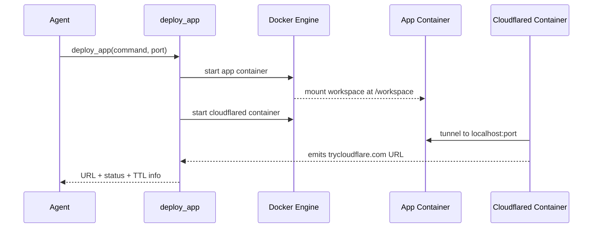

Karakteristik:

- Satu session punya satu active deployment.
- Container app: `madeploy-app-{session}`.
- Container Cloudflare: `madeploy-cf-{session}`.
- Public URL: `https://*.trycloudflare.com`.
- TTL default 1 jam (`DEPLOYMENT_TTL_SECONDS`).
- Max concurrent deployment default 10 (`MAX_DEPLOYMENTS`).
- Old deployment bisa di-evict jika melebihi cap.

## 19. Sub-Agent Layer

Subagent dibangun oleh `app/core/engine/subagent_builder.py`.

### Built-in System Subagents

| Subagent | Fungsi |
| --- | --- |
| `sys_critic` | Reviewer kualitas, menemukan gap/risiko. |
| `sys_researcher` | Riset internet memakai HTTP/Tavily. |
| `sys_coder` | Membuat app/web/prototype, memakai sandbox dan deploy. |
| `sys_writer` | Menulis, merapikan, mengedit konten. |
| `sys_system_message_builder` | Menulis system prompt WhatsApp/agent. |
| `sys_analyst` | Analisis data memakai sandbox. |

### Subagent Sandbox

Jika subagent butuh sandbox:

- Dibuat `DockerSandbox` khusus subagent.
- Deep Agents backend dipasang ke subagent.
- Deployment tools bisa dibind ke subagent sandbox.

### WA Media Tool Exposure

Subagent tidak selalu diberi tool kirim media. Ada deteksi:

- Jika user minta file/gambar/dokumen, media tools bisa dibuka.
- Jika user minta "link aja", "bentuk link", "tanpa QR", media tools tidak dibuka agar tidak spam gambar/dokumen.

### `sys_coder`

`sys_coder` adalah subagent untuk coding/deployment.

Prinsip:

- Untuk static web, gunakan vanilla HTML/CSS/JS kecuali user jelas minta stack lain.
- Tulis artifact di workspace.
- Jalankan server, biasanya `python3 -m http.server 8080`.
- Deploy dengan `deploy_app`.
- Final answer harus menyebut file dan URL.

## 20. WhatsApp Channel

Endpoint utama: `/v1/channels/wa/incoming`.

### Inbound Resolution

Flow inbound:

1. Terima event dari WhatsApp service.
2. Dedupe by `(device_id, from_phone, timestamp)`.
3. Resolve agent:
   - `wadev_<agent_uuid>` untuk shared trial.
   - atau `agent.wa_device_id`.
4. Bedakan customer vs operator.
5. Cek allowlist `allowed_senders` untuk non-operator.
6. Find/create session.
7. Process media.
8. Cek quota.
9. Run agent.
10. Kirim reply.

### Media Processing

Media masuk bisa berupa:

- image
- sticker
- document
- audio
- ptt/voice note

Processing:

- File disimpan ke sandbox workspace.
- Document dicoba extract text via file processor.
- Audio/voice ditranskripsi via transcription service.
- Metadata media disimpan ke `session.metadata_["last_incoming_media"]` agar bisa diteruskan saat escalation.

### Long Running Task dan Interrupt

Jika user mengirim pesan baru saat run lama masih bekerja:

- Runtime cancel active run.
- Mark interrupted/cancelled.
- Release session lock cepat.
- Pesan terbaru diprioritaskan.

Ini penting untuk UX WhatsApp: user tidak boleh "didiamkan" karena job lama masih jalan.

### Duplicate Reply Guard

WhatsApp final reply punya guard agar agent tidak mengirim hasil berkali-kali, terutama saat:

- tool sudah mengirim media/link langsung.
- subagent sudah mengirim artifact.
- final message berpotensi duplikat.

## 21. Escalation dan Operator

Escalation dipakai saat agent butuh manusia, misalnya:

- bukti pembayaran harus diverifikasi admin.
- customer marah/komplain.
- request di luar wewenang.
- agent butuh approval sebelum kirim hasil.

### Escalation Flow

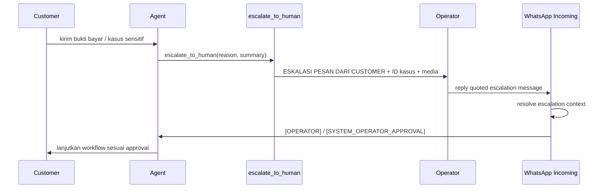

### Format Eskalasi

Operator message harus jelas:

- `ESKALASI PESAN DARI CUSTOMER`
- `ID Kasus`
- `Nomor customer/user`
- `Nama customer`
- `Alasan eskalasi`
- `Pesan`
- `Cara balas customer`

Lampiran customer diteruskan ke operator dengan caption kasus.

### Operator Reply Routing

Operator reply bisa diroute dengan:

- quoted WhatsApp message ID.
- quoted case ID.
- active route TTL.
- metadata escalation di session customer.

Jika operator tidak quote escalation dan tidak ada active route, sistem tidak boleh asal memakai latest escalation karena rawan salah customer.

### Payment Approval Resume

Untuk agent bisnis apa pun yang perlu validasi pembayaran atau approval admin:

1. Customer kirim bukti bayar.
2. Agent eskalasi ke admin/operator.
3. Operator reply "pembayaran sudah masuk" pada escalation.
4. Sistem membuat event sintetis `[SYSTEM_OPERATOR_APPROVAL]` di session customer.
5. Agent melanjutkan workflow customer, bukan membuat ulang kerja di session operator.
6. Agent boleh mengirim deliverable jika state sudah approved.

## 22. Token, Quota, dan Subscription

Quota service ada di `app/core/domain/agent_quota_service.py`.

### Hard Gate Sebelum Run

`check_agent_quota(agent, db)` mengecek:

1. `agent.active_until` belum expired.
2. `agent.tokens_used < agent.token_quota`, kecuali `token_quota <= 0` yang berarti unlimited.
3. Owner subscription ada dan usable jika `owner_external_id` tersedia.
4. `subscription.tokens_used < subscription.token_quota`. Tier 3 default sekarang tetap dibatasi 100,000,000 token; quota `0` hanya diperlakukan sebagai custom/unlimited legacy.

Jika gagal, run tidak boleh memanggil LLM.

### Usage Accounting Setelah Run

`record_agent_token_usage(agent, tokens_used, db)`:

- increment `agent.tokens_used`.
- increment owner `UserSubscription.tokens_used` jika ada.

`Run` tetap menyimpan detail token per eksekusi untuk audit.

### Catatan Penting

Quota dicek sebelum run. Jika satu run besar dimulai saat quota masih cukup, run itu bisa membuat usage melewati batas. Run berikutnya harus diblokir. Ini behavior umum untuk sistem quota token, kecuali nanti dibuat streaming budget enforcement di tengah run.

## 23. Scheduler dan Proactive Agent

Scheduler ada di:

- `app/core/tools/scheduler_tool.py`
- `app/core/workers/scheduler_service.py`
- `app/models/scheduled_job.py`

### Scheduler Service

Setiap menit:

1. Query `ScheduledJob` aktif yang `next_run_at <= now`.
2. Run job dengan concurrency cap 5.
3. Inject payload ke agent:
   - `[SCHEDULED_REMINDER] ...`
   - atau `[HEARTBEAT] ...`
4. Kirim hasil ke channel session:
   - WhatsApp/channel external.
   - SSE event bus untuk UI/API.
5. Update `last_run_at`, `next_run_at`, atau status `done`.

Standalone worker memakai PostgreSQL advisory lock agar multi-instance tidak double-run job.

### Heartbeat

Heartbeat adalah proactive checklist:

- Cek quiet hours.
- Cari latest session user.
- Load checklist dari memory.
- Run agent dengan `[HEARTBEAT]`.
- Jika agent reply `HEARTBEAT_OK`, tidak mengirim pesan.
- Jika ada pesan penting, kirim ke channel.

## 24. Event Bus dan Streaming

Project punya stream/event layer di `app/core/workers/event_bus.py` dan router `stream`.

Fungsinya:

- Publish progress message.
- Publish scheduled/heartbeat message.
- Support SSE realtime untuk UI.
- Redis bisa dipakai untuk multi-process.
- Jika `redis_url` kosong, fallback in-memory hanya aman untuk single-worker.

## 25. Observability dan Reliability

### Logging

Project memakai `structlog`.

Contoh event penting:

- `agent_run.error`
- `wa_incoming.agent_error`
- `agent_step.tool_start`
- `agent_step.tool_end`
- `agent_step.llm_usage`
- `scheduler_service.running_job`
- `deployment.ready`
- `heartbeat.notify`

### Metrics

Prometheus Instrumentator diekspos di `/metrics`.

### Run State

`Run` menjadi audit trail:

- run sukses/gagal/cancelled.
- token usage.
- cost.
- error message.

### Session Lock

`session_lock` mencegah dua run pada session yang sama saling tabrakan.

Ada mekanisme:

- register active task.
- cancel active run.
- force release lock jika cleanup terlalu lama.
- unregister task secara hati-hati.

### Restart Recovery

Saat startup:

- `Run.status='running'` lama ditandai `abandoned`.
- `load_history()` memfilter user message dari run abandoned/cancelled/failed/timed_out.

Tujuannya agar service restart tidak menghidupkan ulang tugas lama tanpa konfirmasi user.

## 26. Security dan Tenancy

### API Auth

Endpoint message API memakai `X-Agent-Key` yang dicocokkan dengan `agent.api_key`.

User API key disimpan dalam bentuk hash di `UserApiKey`, bukan plaintext.

### Ownership

Agent baru punya:

- `owner_external_id`
- `operator_ids`
- subscription owner
- per-agent quota

Legacy agent tetap dihitung lewat `operator_ids` agar slot subscription tidak bocor.

### WhatsApp Access Control

Agent WhatsApp bisa membatasi pengirim lewat:

- `allowed_senders`
- operator phone
- owner external ID

### Sandbox Isolation

Sandbox membatasi:

- workspace path traversal.
- eksekusi Docker terpisah.
- max concurrent sandbox.
- binary read guard untuk menghindari payload binary merusak provider LLM.

### MCP Auth

Google Workspace MCP memakai token per-user, bukan static global token, agar side effect eksternal terjadi atas nama user yang benar.

## 27. Configuration

Settings utama ada di `app/config.py`.

| Setting | Fungsi |
| --- | --- |
| `database_url` | PostgreSQL async URL. |
| `api_key` | Platform API key. |
| `openrouter_api_key` | LLM via OpenRouter. |
| `mistral_api_key` | Mistral dan PDF OCR. |
| `tavily_api_key` | Web search. |
| `sandbox_base_dir` | Base folder sandbox. |
| `docker_sandbox_image` | Image Docker sandbox. |
| `docker_host` | Docker socket. |
| `agent_max_steps` | Batas step agent. |
| `agent_timeout_seconds` | Timeout run. |
| `short_term_memory_turns` | Turn history yang masuk context. |
| `ltm_extraction_every` | Frekuensi extraction long-term memory. |
| `wa_service_url` | WhatsApp service utama. |
| `wa_dev_service_url` | WhatsApp dev/trial service. |
| `wa_dev_public_phone` | Nomor shared trial. |
| `workspace_mcp_runtime_url` | Runtime URL MCP Google Workspace. |
| `workspace_mcp_prefer_local` | Prefer local MCP runtime. |
| `redis_url` | Redis untuk event bus/rate limit multi-process. |
| `llm_max_tokens` | Fallback max tokens LLM. |
| `media_doc_max_chars` | Batas text extraction dokumen. |
| `message_max_length` | Batas panjang message. |
| `media_max_length` | Batas payload media. |
| `max_concurrent_sandboxes` | Batas sandbox Docker paralel. |

## 28. Contoh Use Case: Agent CV Maker

Bagian ini hanya contoh implementasi agent yang bisa dibuat user lewat Arthur, bukan fitur khusus atau requirement inti platform. Contoh CV maker dipakai karena memperlihatkan pola umum platform: intake data, kerja di sandbox, payment/approval, escalation ke admin, lalu delivery hasil.

### Setup oleh Arthur

1. Arthur interview owner bisnis:
   - target customer.
   - harga.
   - data yang dibutuhkan.
   - aturan pembayaran.
   - siapa admin/operator.
   - format deliverable.
2. Arthur membuat blueprint:
   - role: CV Maker Assistant.
   - state machine: intake -> drafting -> waiting_payment -> payment_review -> approved -> delivery -> aftercare.
   - escalation: bukti bayar ke admin.
   - delivery: file CV hanya dikirim setelah approval.
3. Arthur create agent.
4. Arthur kirim trial link WhatsApp.

### Runtime Customer

1. Customer chat agent.
2. Agent mengumpulkan data CV.
3. Agent membuat draft/final file di sandbox.
4. Agent meminta payment.
5. Customer kirim screenshot transfer.
6. Agent eskalasi ke operator dengan lampiran.
7. Operator reply quoted: "pembayaran sudah masuk".
8. System mengirim approval event ke session customer.
9. Agent mengirim file CV ke customer.
10. Agent menyimpan status ke memory agar tidak mengulang pembuatan CV.

### Risiko yang Harus Dijaga

- Jangan menjalankan ulang pembuatan CV di session operator.
- Jangan salah mengira document customer sebagai escalation dari operator.
- Jangan kirim file sebelum approval.
- Jangan mengirim hasil berkali-kali.
- Jangan kehilangan state setelah restart.
- Jangan memakai quota setelah habis.

## 29. Narasi Presentasi Produk

Poin yang bisa dipakai saat presentasi:

1. Platform ini membuat agent AI yang bisa bekerja, bukan hanya menjawab chat.
2. Arthur menurunkan barrier: user cukup menjelaskan usaha/kebutuhan, Arthur yang menyusun agent.
3. Setiap agent punya tool runtime yang bisa dikontrol per capability.
4. Memory dibuat berlapis: identitas agent, profil user, daily notes, long-term summary.
5. RAG membuat agent menjawab dari knowledge base sendiri.
6. MCP membuka integrasi eksternal seperti Google Workspace dengan auth per-user.
7. Sandbox membuat agent bisa mengerjakan artifact nyata seperti file, analisis data, dan website.
8. Sub-agent memungkinkan pembagian kerja: coder, researcher, critic, writer, analyst.
9. WhatsApp bukan sekadar channel chat; ada media, dokumen, audio, escalation, operator reply routing, dan proactive reminders.
10. Token/quota dan subscription membuat platform siap SaaS multi-tenant.

## 30. Current Design Notes

Beberapa catatan teknis yang penting untuk maintainability:

- `run_agent` adalah orchestration entrypoint, tetapi sebagian besar detail sudah diekstrak ke modul engine lain seperti `agent_tool_setup.py`, `tool_builder.py`, `prompt_builder.py`, `subagent_builder.py`, `context_service.py`, dan `result_parser.py`.
- RAG utama saat ini adalah prompt-injected retrieval dari `agent_runner`, bukan tool call RAG eksplisit.
- Redis optional. Tanpa Redis, event bus fallback in-memory cocok untuk single-worker.
- Token quota adalah hard gate sebelum run, bukan mid-run budget interrupter.
- Deep Agents `interrupt_on` bukan mekanisme interrupt user message. Interruption user ditangani di app layer lewat task cancellation dan session lock.
- Arthur harus tetap memakai identity WhatsApp Arthur sendiri; WA dev shared number hanya untuk agent trial user.

## 31. Source Map Cepat

| Topik | File utama |
| --- | --- |
| FastAPI app | `app/main.py` |
| Message API | `app/api/messages.py` |
| WhatsApp incoming | `app/api/channels.py` |
| WhatsApp helpers/media | `app/api/wa_helpers.py` |
| Agent runtime | `app/core/engine/agent_runner.py` |
| Tool setup | `app/core/engine/agent_tool_setup.py` |
| Tool builder | `app/core/engine/tool_builder.py` |
| Prompt builder | `app/core/engine/prompt_builder.py` |
| LLM setup | `app/core/engine/agent_llm.py` |
| Runtime policy | `app/core/engine/agent_policy.py` |
| Deep Agents backend | `app/core/engine/deep_agent_backend.py` |
| Subagent builder | `app/core/engine/subagent_builder.py` |
| Context/history | `app/core/engine/context_service.py` |
| Token callback | `app/core/engine/agent_callbacks.py` |
| Arthur builder tools | `app/core/tools/builder_tools.py` |
| Escalation tools | `app/core/tools/escalation_tool.py` |
| Operator tools | `app/core/tools/operator_tools.py` |
| MCP tools | `app/core/tools/mcp_tool.py` |
| Deployment tools | `app/core/tools/deployment_tools.py` |
| Scheduler tools | `app/core/tools/scheduler_tool.py` |
| Sandbox infra | `app/core/infra/sandbox.py` |
| Deployment infra | `app/core/infra/deployment_service.py` |
| WhatsApp client | `app/core/infra/wa_client.py` |
| Channel service | `app/core/infra/channel_service.py` |
| Memory service | `app/core/domain/memory_service.py` |
| Document/RAG service | `app/core/domain/document_service.py` |
| Embedding service | `app/core/domain/embedding_service.py` |
| Subscription service | `app/core/domain/subscription_service.py` |
| Quota service | `app/core/domain/agent_quota_service.py` |
| Scheduler service | `app/core/workers/scheduler_service.py` |
| Event bus | `app/core/workers/event_bus.py` |
| Config | `app/config.py` |
| Tools config schema | `app/core/config_schema.py` |
